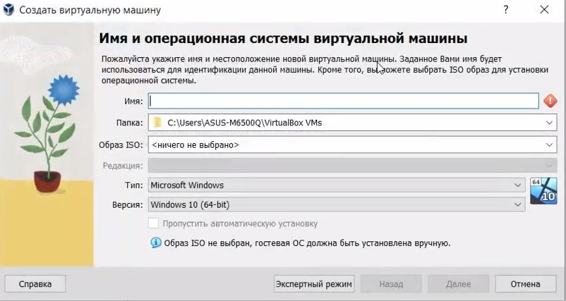
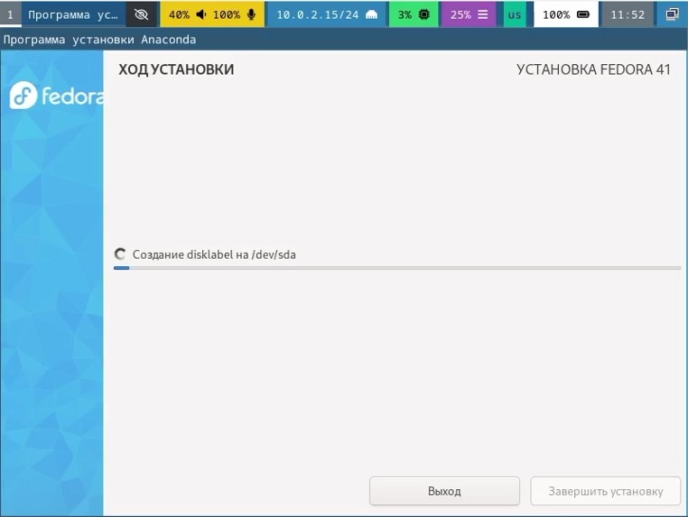
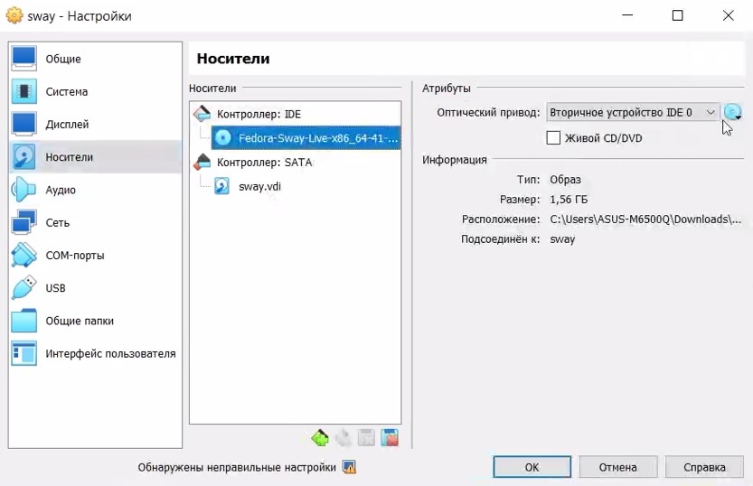
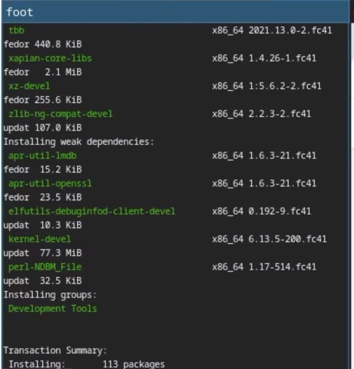
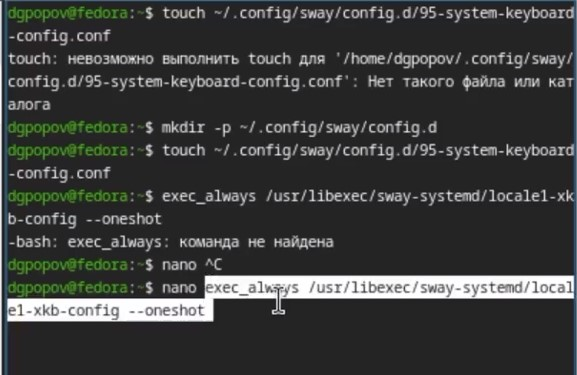
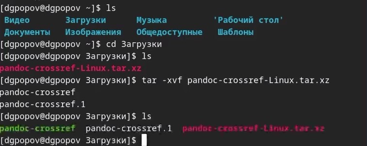
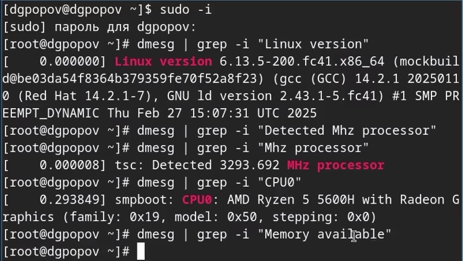

---
## Front matter
lang: ru-RU
title: Лабораторная работа №1
subtitle: Презентация
author:
  - Попов Даниил Георгиевич
institute:
  - Российский университет дружбы народов, Москва, Россия

## i18n babel
babel-lang: russian
babel-otherlangs: english

## Formatting pdf
toc: false
toc-title: Содержание
slide_level: 2
aspectratio: 169
section-titles: true
theme: metropolis
header-includes:
 - \metroset{progressbar=frametitle,sectionpage=progressbar,numbering=fraction}
---

# Информация

## Докладчик

:::::::::::::: {.columns align=center}
::: {.column width="70%"}

  * Попов Даниил Георгиевич


# Вводная часть


## Цели и задачи

Установить Fedora sway на вирутальную машину

## Материалы и методы

- VMVirtualBox
- Fedora sway

# Создание презентации

## Процессор `pandoc`

- Pandoc: преобразователь текстовых файлов
- Сайт: <https://pandoc.org/>
- Репозиторий: <https://github.com/jgm/pandoc>

## Формат `pdf`

- Использование LaTeX
- Пакет для презентации: [beamer](https://ctan.org/pkg/beamer)
- Тема оформления: `metropolis`

## Код для формата `pdf`

```yaml
slide_level: 2
aspectratio: 169
section-titles: true
theme: metropolis
```

## Формат `html`

- Используется фреймворк [reveal.js](https://revealjs.com/)
- Используется [тема](https://revealjs.com/themes/) `beige`

## Код для формата `html`

- Тема задаётся в файле `Makefile`

```make
REVEALJS_THEME = beige 
```
# Результаты

## Получающиеся форматы

- Полученный `pdf`-файл можно демонстрировать в любой программе просмотра `pdf`
- Полученный `html`-файл содержит в себе все ресурсы: изображения, css, скрипты

# Элементы презентации

## Цели и задачи

- Установить Fedora sway на вирутальную машину

## Материалы и методы

- VMVirtualBox
- Fedora sway

## Содержание исследования

Создаем виртуальную машину  
  

Устанавливаем sway на диск с помощью liveinst   
  

В настройках виртуальной машины извлекаем оброз, чтобы работало с основного диска  
  

Устанвалиавем базовые пакеты  
  

Настройка клавиатуры  
  

Загружаем pandoc и crossref к нему с github  
  

Выполнение домашней работы  


## Результаты

- Установили виртуальную машину


## Итоговый слайд

- Спасибо за внимание!

